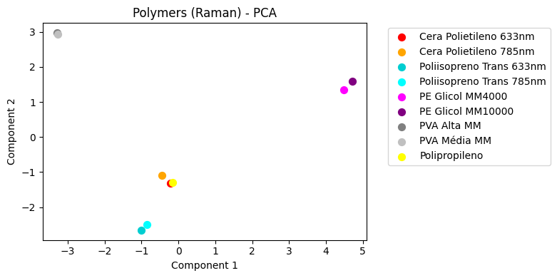

# Raman Spectroscopy

Este repositório contém notebooks voltados para análise de espectros Raman, com foco em limpeza de dados e análise via PCA.

## Conteúdo

- **data/**: Pasta destinada ao dataset (bruto e limpo).
- **cleaning.ipynb**: Notebook para processamento e limpeza dos dados espectroscópicos, adaptando-os para o PCA.
- **spectral_data_pca.ipynb**: Notebook que realiza análise por *Principal Component Analysis* para redução de dimensionalidade e exploração dos dados espectrais.

## Visualização da análise PCA

Abaixo, veja o resultado da análise de PCA:

## Conclusões

- **Massa Molecular**: Note que a massa molecular para um mesmo polímero não é um fator relevante para o espectro.

- **Comprimento de Onda**: Note também que o comprimento de onda do laser pouco afeta o espectro.
